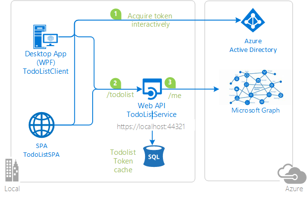

# Calling a downstream web API from a web API using Azure AD

## About this sample

### Overview

In this sample, the native client and a simple JavaScript single page application:

1. Acquire a token to act On Behalf Of the user.
2. Call a web API (`TodoListService`)
3. Which itself calls another downstream Web API (The Microsoft Graph)

The TodoListService uses a database to:

- Store the todo list
- Illustrate [token cache serialization](https://github.com/AzureAD/azure-activedirectory-library-for-dotnet/wiki/Token-cache-serialization) in a service

   

### Scenario. How the sample uses ADAL.NET (and ADAL.js)

- `TodoListClient` uses  Active Directory Authentication Library for .NET (ADAL.NET) to acquire a token for the user in order to call the first web API. For more information about how to acquire tokens interactively, see [Acquiring tokens interactively Public client application flows](https://github.com/AzureAD/azure-activedirectory-library-for-dotnet/wiki/Acquiring-tokens-interactively---Public-client-application-flows).
- `TodoListSPA`, the single page application, uses [ADAL.js](https://github.com/AzureAD/azure-activedirectory-library-for-js). When the user enters a todo item, `TodoListClient` and `TodoListSPA` call `TodoListService`  on the `/todolist` endpoint.
- Then `TodoListService` also uses ADAL.NET  to get a token to act on behalf of the user to call the Microsoft Graph. For details, see [Service to service calls on behalf of the user](https://github.com/AzureAD/azure-activedirectory-library-for-dotnet/wiki/Service-to-service-calls-on-behalf-of-the-user). It then decorates the todolist item entered by the user, with the First name and the Last name of the user. Below is a screen copy of what happens when the user named *automation service account* entered "item1" in the textbox.

  

Both flows use the OAuth 2.0 protocol to obtain the tokens. For more information about how the protocols work in this scenario and other scenarios, see [Authentication Scenarios for Azure AD](http://go.microsoft.com/fwlink/?LinkId=394414).

> Looking for previous versions of this code sample? Check out the tags on the [releases](../../releases) GitHub page.

## How to run this Sample

To run this sample, you will need:

- [Visual Studio 2017](https://aka.ms/vsdownload)
- An Internet connection
- An Azure Active Directory (Azure AD) tenant. For more information on how to get an Azure AD tenant, see [How to get an Azure AD tenant](https://azure.microsoft.com/en-us/documentation/articles/active-directory-howto-tenant/)
- A user account in your Azure AD tenant. This sample will not work with a Microsoft account: if you signed in to the [Azure portal](https://portal.azure.com) with a Microsoft account and have never created a user account in your directory before, you need to do that now.

### Step 1:  Clone or download this repository

From your shell or command line:

`git clone https://github.com/Azure-Samples/active-directory-dotnet-webapi-onbehalfof.git`

### Step 2:  Register the sample with your Azure Active Directory tenant

There are three projects in this sample.  Each needs to be separately registered in your Azure AD tenant.

To register these projects, you can  follow the steps in the paragraphs below. Alternatively, you can use a PowerShell script, which:

1. Creates the Azure AD applications and related objects (passwords, permissions, dependencies)
2. Modifies the project's configuration files for you.

If you want to do use this automation, read these instructions [App Creation Scripts](./AppCreationScripts/AppCreationScripts.md), otherwise, keep reading.

#### Register the TodoListService web API

1. Sign in to the [Azure portal](https://portal.azure.com).
2. On the top bar, click on your account and under the **Directory** list, choose the Active Directory tenant where you wish to register your application.
3. Click on **All Services** in the left hand nav, and choose **Azure Active Directory**.
4. Click on **App registrations** and choose **New application registration**.
5. Enter a friendly name for the application, for example 'TodoListService' and select 'Web app / API' as the Application Type. For the sign-on URL, enter the base URL for the sample, which is by default `https://localhost:44321`. Click on **Create** to create the application.
6. In the succeeding page, find the **Application ID** value and copy it to the clipboard.
7. Then click on **Settings** and choose **Properties**.
8. For the App ID URI, replace the guid in the generated URI 'https://\<your_tenant_name\>/<guid>', with the name of your service, e.g. 'https://\<your_tenant_name\>/TodoListService'.
9. From the Settings menu, choose **Keys** and add a key
    - Select a key duration of either **1 year**, **2 years** or **Never Expires**. When you save this page, the key value will be displayed, copy, and save the value in a safe location.
    - You will need this key later to configure the project in Visual Studio.
    - This key value will not be displayed again, nor retrievable by any other means, so record it as soon as it is visible in the Azure Portal.

NOTE:  In this sample, the `TodoListService` makes a delegated identity call to the Microsoft Graph API to read the user's profile.  By default, when the `TodoListService` is registered with Active Directory, it is configured to request permission to the AAD Graph API. you can see this in the "Required Permissions" configuration section.  If you modify the `TodoListService` to call a different API, or if you build your own service that makes an On-Behalf-Of call, the service it calls and the permissions it requires must be added to the "Required Permissions" configuration in Azure AD.

#### Register the TodoListClient app

1. Sign in to the [Azure portal](https://portal.azure.com).
2. On the top bar, click on your account and under the **Directory** list, choose the Active Directory tenant where you wish to register your application.
3. Click on **More Services** in the left-hand nav, and choose **Azure Active Directory**.
4. Click on **App registrations** and choose **New application registration**.
5. Enter a friendly name for the application, for example 'TodoListClient-DotNet' and select 'Native' as the Application Type. For the redirect URI, enter `https://TodoListClient`. Note that the Redirect URI will not be used in this sample, but it needs to be defined nonetheless. Click on **Create** to create the application.
6. In the succeeding page, find the **Application ID** value and copy it to the clipboard. 
7. While still in the Azure portal, choose your application, click on **Settings**, and choose **Properties**.
8. Configure Permissions for your application - in the Settings menu, choose the 'Required permissions' section, click on **Add**, then **Select an API**, and type 'TodoListService' in the textbox. Then, click on  **Select Permissions** and select 'Access TodoListService'.

#### [Optional] Register the TodoListSPA app

1. Sign in to the [Azure portal](https://portal.azure.com).
2. On the top bar, click on your account and under the **Directory** list, choose the Active Directory tenant where you wish to register your application.
3. Click on **More Services** in the left-hand nav, and choose **Azure Active Directory**.
4. Click on **App registrations** and choose **New application registration**.
5. Enter a friendly name for the application, for example 'TodoListSPA' and select 'Web app / API' as the Application Type. For the redirect URI, enter `https://localhost:44377/`. Click on **Create** to create the application.
6. In the succeeding page, find the **Application ID** value and copy it to the clipboard. 
7. Enable the OAuth 2 implicit grant for your application by choosing **Manifest** at the top of the application's page. Open the inline manifest editor. Search for the ``oauth2AllowImplicitFlow`` property. You will find that it is set to ``false``; change it to ``true`` and click on Save to save the manifest. 
8. While still in the Azure portal, choose your application, click on **Settings**, and choose **Properties**
9. Configure Permissions for your application - in the Settings menu, choose the 'Required permissions' section, click on **Add**, then **Select an API**, and type 'TodoListService' in the textbox. Then, click on  **Select Permissions** and select 'Access TodoListService'.

#### Configure known client applications

For the middle tier web API (`TodoListService`) to be able to call the downstream web API (here `Microsoft Graph`), the user must grant the middle tier permission to do so in the form of consent.  Because the middle tier has no interactive UI of its own, you need to explicitly bind the client app registration in Azure AD with the registration for the web API. This binding merges the consent required by both the client & middle tier into a single dialog. You can do so by adding the "Client ID" of the client app, to the manifest of the web API in the `knownClientApplications` property. Here's how:

1. Navigate to your 'TodoListService' app registration, and open the manifest editor.
2. In the manifest, locate the `knownClientApplications` array property, and add the Client ID of your client application as an element.  Your code should look like the following after you're done:
    `"knownClientApplications": ["94da0930-763f-45c7-8d26-04d5938baab2"]`
3. Save the TodoListService manifest by clicking the "Save" button.
4. [Optionally] do the same with the ClientID of your single page JavaScript application's registration if you created it.

### Step 3:  Configure the sample to use your Azure AD tenant

#### Configure the TodoListService project

1. Open the solution in Visual Studio.
2. Open the `web.config` file.
3. Find the app key `ida:Tenant` and replace the value with your AAD tenant name.
4. Find the app key `ida:Audience` and replace the value with the App ID URI you registered earlier, for example `https://<your_tenant_name>/TodoListService`.
5. Find the app key `ida:ClientId` and replace the value with the Client ID for the TodoListService from the Azure portal.
6. Find the app key `ida:AppKey` and replace the value with the key for the TodoListService from the Azure portal.

#### Configure the TodoListClient project

1. Open `app.config`
2. Find the app key `ida:Tenant` and replace the value with your AAD tenant name.
3. Find the app key `ida:ClientId` and replace the value with the Client ID for the TodoListClient from the Azure portal.
4. Find the app key `ida:RedirectUri` and replace the value with the Redirect URI for the TodoListClient from the Azure portal, for example `https://TodoListClient`.
5. Find the app key `todo:TodoListResourceId` and replace the value with the  App ID URI of the TodoListService, for example `https://<your_tenant_name>/TodoListService`
6. Find the app key `todo:TodoListBaseAddress` and replace the value with the base address of the TodoListService project.

#### [Optionally] Configure the TodoListSPA project

If you have configured the TodoListSPA application in Azure AD, you want to update the JavaScript project:

1. Open `appconfig.js`.
2. In the `config`variable (which is about the Azure AD TodoListSPA configuration):
  - find the member named `tenant` and replace the value with your AAD tenant name.
  - find the member named `clientId` and replace the value with the Client ID for the TodoListSPA application from the Azure portal.
  - find the member named `redirectUri` and replace the value with the redirect URI you provided for the TodoListSPA application from the Azure portal, e.g. `https://localhost:44377/`.
3. In the `WebApiConfig`variable (which is about configuration of the resource, that is the TodoListService):
  - find the member named `resourceId` and replace the value with the  App ID URI of the TodoListService, for example `https://<your_tenant_name>/TodoListService`.
4. While running the SPA app in the browser, take care to allow popups from this app.

### Step 4:  Run the sample

Clean the solution, rebuild the solution, and run it. You might want to go into the solution properties and set both projects, or the three projects, as startup projects, with the service project starting first.

Explore the sample by signing in, adding items to the To Do list, Clearing the cache (which removes the user account), and starting again.  The To Do list service will take the user's access token, received from the client, and use it to get another access token so it can act On Behalf Of the user in the Microsoft Graph API.  This sample caches the user's access token at the To Do list service, so it does not request a new access token on every request. This cache is a database cache.

[Optionally], when you have added a few items with the TodoList Client, login to the todoListSPA with the same credentials as the todoListClient, and observe the id-Token, and the content of the Todo List as stored on the service, but as Json. This will help you understand the information circulating on the network.

## About The Code

The code using ADAL.NET is in the [TodoListClient/MainWindow.xaml.cs](TodoListClient/MainWindow.xaml.cs) file in the `SignIn()` method. See [More information][#More-information] below for details on how this work. The call to the TodoListService is done in the `AddTodoItem()` method.

The code for the Token cache serialization on the client side (in a file) is in [TodoListClient/FileCache.cs](TodoListClient/FileCache.cs)

The code acquiring a token on behalf of the user from the service side is in [TodoListService/Controllers/TodoListController.cs](TodoListService/Controllers/TodoListController.cs)

The code for the Service side serialization (in a database) is in [TodoListService/DAL/DbTokenCache.cs](TodoListService/DAL/DbTokenCache.cs) in the `CallGraphAPIOnBehalfOfUser()` method.

## How To Recreate This Sample

First, in Visual Studio 2017 create an empty solution to host the  projects. Then, follow these steps to create each project.

### Creating the TodoListService Project

1. In Visual Studio 2017, create a new `Visual C#` `ASP.NET Web Application (.NET Framework)` project. In the next screen, choose the `Web API` project template.  And while on this screen, click the Change Authentication button, select 'Work or School Accounts', 'Cloud - Single Organization', enter the name of your Azure AD tenant.  You will be prompted to sign in to your Azure AD tenant.  NOTE:  You must sign in with a user that is in the tenant; you cannot, during this step, sign in with a Microsoft account.
2. Add the Active Directory Authentication Library (ADAL) NuGet, Microsoft.IdentityModel.Clients.ActiveDirectory, EntityFramework and Microsoft.AspNet.WebApi.Cors to the project.
3. Add reference of the `System.IdentityModel` assembly in the project.
3. In the `Models` folder, add a new class called `TodoItem.cs`.  Copy the implementation of TodoItem from this sample into the class.
4. In the `Models` folder, add a new class called `UserProfile.cs`.  Copy the implementation of UserProfile from this sample into the class.
5. Create a new folder named `DAL`.In the `DAL` folder, add a new class called `DbTokenCache.cs`.  Copy the implementation of DbTokenCache from this sample into the class.
6. In the `DAL` folder, add a new class called `TodoListServiceContext.cs`.  Copy the implementation of TodoListServiceContext from this sample into the class.
7. Add a new class named `Extensions` in the project. Replace the implementation with the contents of the file of the same name from the sample.
7. Add a new, empty, Web API 2 Controller called `TodoListController`.
8. Copy the implementation of the TodoListController from this sample into the controller.  Don't forget to add the `[Authorize]` attribute to the class.

10. In `web.config` make sure that the key `ida:AADInstance`, `ida:Tenant`, `ida:ClientID`, and `ida:Password` exist, and are populated.  For the global Azure cloud, the value of `ida:AADInstance` is `https://login.onmicrosoft.com/{0}`.
11. In `web.config`, in `<appSettings>`, create keys for `ida:GraphResourceId` and `ida:GraphUserUrl` and set the values accordingly.  For the global Azure AD, the value of `ida:GraphResourceId` is `https://graph.microsoft.com`, and the value of `ida:GraphUserUrl` is `https://graph.microsoft.com/v1.0/me/`.

### Creating the TodoListClient Project

1. In the solution, create a new Windows --> Windows Classic Desktop -> WPF App(.NET Framework)  called TodoListClient.
2. Add the Active Directory Authentication Library (ADAL) NuGet, Microsoft.IdentityModel.Clients.ActiveDirectory to the project.
3. Add  assembly references to `System.Net.Http`, `System.Web.Extensions`, and `System.Configuration`.
4. Add a new class to the project called `TodoItem.cs`.  Copy the code from the sample project file of the same name into this class, completely replacing the code in the file in the new project.
5. Add a new class to the project called `FileCache.cs`.  Copy the code from the sample project file of the same name into this class, completely replacing the code in the file in the new project.
6. Copy the markup from `MainWindow.xaml' in the sample project into the file of the same name in the new project, completely replacing the markup in the file in the new project.
7. Copy the code from `MainWindow.xaml.cs` in the sample project into the file of the same name in the new project, completely replacing the code in the file in the new project.
8. In `app.config` create keys for `ida:AADInstance`, `ida:Tenant`, `ida:ClientId`, `ida:RedirectUri`, `todo:TodoListResourceId`, and `todo:TodoListBaseAddress` and set them accordingly.  For the global Azure cloud, the value of `ida:AADInstance` is `https://login.onmicrosoft.com/{0}`.

Finally, in the properties of the solution itself, set both projects as startup projects.

## Community Help and Support

We use [Stack Overflow](http://stackoverflow.com/questions/tagged/msal) with the community to provide support. We highly recommend you ask your questions on Stack Overflow first and browse existing issues to see if someone has asked your question before. Make sure that your questions or comments are tagged with [msal.dotnet].

If you find and bug in the sample, please raise the issue on [GitHub Issues](../../issues).

To provide a recommendation, visit the following [User Voice page](https://feedback.azure.com/forums/169401-azure-active-directory).

## Contributing

If you'd like to contribute to this sample, see [CONTRIBUTING.MD](/CONTRIBUTING.md).

This project has adopted the [Microsoft Open Source Code of Conduct](https://opensource.microsoft.com/codeofconduct/). For more information, see the [Code of Conduct FAQ](https://opensource.microsoft.com/codeofconduct/faq/) or contact [opencode@microsoft.com](mailto:opencode@microsoft.com) with any additional questions or comments.

## More information

For more information, see ADAL.NET's conceptual documentation:

- [Recommanded pattern to acquire a token](https://github.com/AzureAD/azure-activedirectory-library-for-dotnet/wiki/AcquireTokenSilentAsync-using-a-cached-token#recommended-pattern-to-acquire-a-token)
- [Acquiring tokens ineractively in public client applications](https://github.com/AzureAD/azure-activedirectory-library-for-dotnet/wiki/Acquiring-tokens-interactively---Public-client-application-flows)
- [Service to service calls on behalf of the user](https://github.com/AzureAD/azure-activedirectory-library-for-dotnet/wiki/Service-to-service-calls-on-behalf-of-the-user).
- [Customizing Token cache serialization](https://github.com/AzureAD/azure-activedirectory-library-for-dotnet/wiki/Token-cache-serialization)
